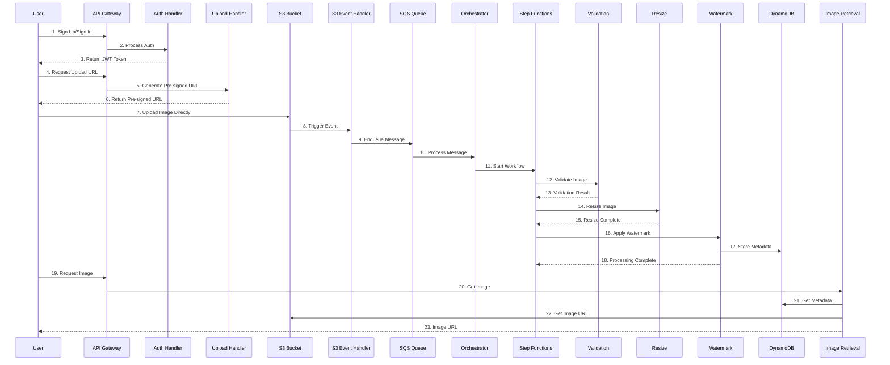

# Serverless Image Processing Platform

A serverless image processing platform built on AWS that provides secure, scalable, and cost-efficient image upload, processing, and metadata management capabilities.

## 🚀 Features

- **🔐 Secure Authentication**: Complete user management with AWS Cognito
- **📤 Direct S3 Uploads**: Pre-signed URLs for secure, direct image uploads
- **🔄 Event-Driven Processing**: Automated image processing pipeline
- **🖼️ Image Operations**: Validation, resizing, and watermarking
- **🔒 Private Networking**: All inter-service communication within AWS VPC
- **📊 Metadata Management**: Comprehensive image metadata storage
- **⚡ Serverless Architecture**: Auto-scaling with no server management
- **💰 Cost Optimized**: Pay-per-use pricing model

## 🎥 Project Walkthrough

[](https://www.youtube.com/watch?v=werhgoCRbgQ&ab_channel=AhmedMoustafa)

Watch a full walkthrough of this project on YouTube by Ahmed Moustafa.

## 🏗️ Architecture
### AWS Architecture Diagram

### High-Level Architecture

```mermaid
graph TB
    User[👤 User] --> APIGW[🌐 API Gateway]
    APIGW --> Auth[🔐 Auth Handler]
    APIGW --> Upload[📤 Upload Handler]
    APIGW --> Retrieve[📥 Image Retrieval]
    
    Auth --> Cognito[👥 Cognito User Pool]
    Upload --> S3Input[📁 S3 Input Bucket]
    Retrieve --> S3Output[📁 S3 Output Bucket]
    
    S3Input --> S3Event[⚡ S3 Event Handler]
    S3Event --> SQS[📬 SQS Queue]
    SQS --> Orchestrator[🎯 Orchestrator]
    Orchestrator --> StepFn[🔄 Step Functions]
    
    StepFn --> Validation[✅ Validation]
    StepFn --> Resize[📏 Resize]
    StepFn --> Watermark[💧 Watermark]
    
    Validation --> S3Output
    Resize --> S3Output
    Watermark --> S3Output
    Watermark --> DynamoDB[🗄️ DynamoDB]
    
    subgraph "Private Network"
        S3Event
        SQS
        Orchestrator
        StepFn
        Validation
        Resize
        Watermark
        DynamoDB
        Retrieve
    end
    
    subgraph "Monitoring"
        CloudWatch[📊 CloudWatch Logs]
    end
```



### Detailed Component Flow



## 🛠️ Technology Stack

| Component | Technology | Purpose |
|-----------|------------|---------|
| **API Layer** | AWS API Gateway | REST API endpoints |
| **Authentication** | AWS Cognito | User management & auth |
| **Compute** | AWS Lambda | Serverless functions |
| **Storage** | Amazon S3 | Image storage |
| **Database** | Amazon DynamoDB | Metadata storage |
| **Queue** | Amazon SQS | Event processing |
| **Orchestration** | AWS Step Functions | Workflow management |
| **Networking** | Amazon VPC | Private networking |
| **Security** | AWS KMS | Encryption |
| **Monitoring** | Amazon CloudWatch | Logging & metrics |

## 📁 Project Structure

```
Serverless-Image-Processing-with-S3-and-Lambda/
├── 📁 terraform/                 # Infrastructure as Code
│   ├── main.tf                  # Main configuration
│   ├── variables.tf             # Input variables
│   ├── outputs.tf               # Output values
│   ├── vpc.tf                   # VPC and networking
│   ├── api_gateway.tf           # API Gateway configuration
│   ├── lambda.tf                # Lambda functions
│   ├── s3.tf                    # S3 buckets
│   ├── sqs.tf                   # SQS queues
│   ├── dynamodb.tf              # DynamoDB tables
│   ├── step_functions.tf        # Step Functions
│   ├── cognito.tf               # Cognito user pool
│   ├── security.tf              # IAM, KMS, security groups
│   └── monitoring.tf            # CloudWatch configuration
├── 📁 src/lambda/               # Lambda function code
│   ├── auth_handler/            # Authentication handler
│   ├── upload_handler/          # Upload URL generator
│   ├── s3_event_handler/        # S3 event processor
│   ├── orchestrator/            # Workflow orchestrator
│   ├── validation/              # Image validation
│   ├── resize/                  # Image resizing
│   ├── watermark/               # Image watermarking
│   └── image_retrieval/         # Image retrieval
├── 📁 docs/                     # Documentation
│   ├── architecture.md          # Architecture details
│   ├── api.md                   # API documentation
│   ├── deployment.md            # Deployment guide
│   └── ...                      # Component-specific docs
├── 📁 diagrams/                 # Architecture diagrams
├── README.md                    # This file
└── DEPLOYMENT.md                # Quick deployment guide
```

## 🚀 Quick Start

### Prerequisites

- AWS CLI configured with appropriate permissions
- Terraform >= 1.0
- Python 3.11+ (for Lambda functions)

### Deployment

1. **Clone the repository**
2. **Deploy infrastructure**
3. **Deploy Lambda functions**
4. **Test the platform**

For detailed deployment instructions, see [DEPLOYMENT.md](DEPLOYMENT.md).

## 📚 API Reference

### Authentication Endpoints

| Endpoint | Method | Description |
|----------|--------|-------------|
| `/auth/signup` | POST | User registration |
| `/auth/signin` | POST | User login |
| `/auth/verify` | POST | Email verification |
| `/auth/forgot-password` | POST | Password reset request |
| `/auth/confirm-forgot-password` | POST | Password reset confirmation |

### Image Processing Endpoints

| Endpoint | Method | Description |
|----------|--------|-------------|
| `/upload` | POST | Get pre-signed upload URL |
| `/image/{image_id}` | GET | Retrieve processed image |

### Example Usage

#### User Registration
```bash
curl -X POST https://your-api-gateway-url/auth/signup \
  -H "Content-Type: application/json" \
  -d '{
    "email": "user@example.com",
    "password": "SecurePassword123!"
  }'
```

#### User Authentication
```bash
curl -X POST https://your-api-gateway-url/auth/signin \
  -H "Content-Type: application/json" \
  -d '{
    "email": "user@example.com",
    "password": "SecurePassword123!"
  }'
```

#### Get Upload URL
```bash
curl -X POST https://your-api-gateway-url/upload \
  -H "Authorization: Bearer <your_jwt_token>" \
  -H "Content-Type: application/json" \
  -d '{
    "filename": "image.jpg",
    "content_type": "image/jpeg"
  }'
```

#### Upload Image
```bash
curl -X PUT "<pre-signed-url>" \
  -H "Content-Type: image/jpeg" \
  -H "x-amz-server-side-encryption: aws:kms" \
  -H "x-amz-server-side-encryption-aws-kms-key-id: <kms-key-id>" \
  --upload-file "image.jpg"
```

#### Retrieve Processed Image
```bash
curl -X GET "https://your-api-gateway-url/image/<image-id>?size=medium" \
  -H "Authorization: Bearer <your_jwt_token>"
```

For complete API documentation, see [docs/api.md](docs/api.md).

## 🔒 Security Features

- **🔐 End-to-End Encryption**: All data encrypted at rest and in transit
- **🛡️ Private Networking**: All backend services communicate within VPC
- **🔑 KMS Encryption**: Customer-managed encryption keys
- **👥 IAM Roles**: Least-privilege access policies
- **🔍 Audit Logging**: Comprehensive CloudWatch logging
- **🌐 CORS Protection**: Configured CORS policies for S3

## 📊 Monitoring & Observability

- **📈 CloudWatch Logs**: Centralized logging for all Lambda functions
- **🔍 X-Ray Tracing**: Distributed tracing for request flows
- **📊 Metrics**: Built-in AWS service metrics
- **🚨 Error Tracking**: Detailed error logging and monitoring

## 💰 Cost Optimization

- **⚡ Serverless**: Pay only for actual usage
- **🔄 Auto-scaling**: Automatic scaling based on demand
- **📦 S3 Lifecycle**: Automatic data lifecycle management
- **🗄️ DynamoDB On-Demand**: Pay-per-request pricing
- **📊 Log Retention**: Configurable log retention periods

## 🧪 Testing

The platform includes comprehensive testing capabilities for authentication flow, image upload and processing, and image retrieval.

## 📖 Documentation

- **[Architecture Guide](docs/architecture.md)**: Detailed architecture explanation
- **[API Documentation](docs/api.md)**: Complete API reference
- **[Deployment Guide](DEPLOYMENT.md)**: Step-by-step deployment instructions
- **[Component Guides](docs/)**: Individual component documentation